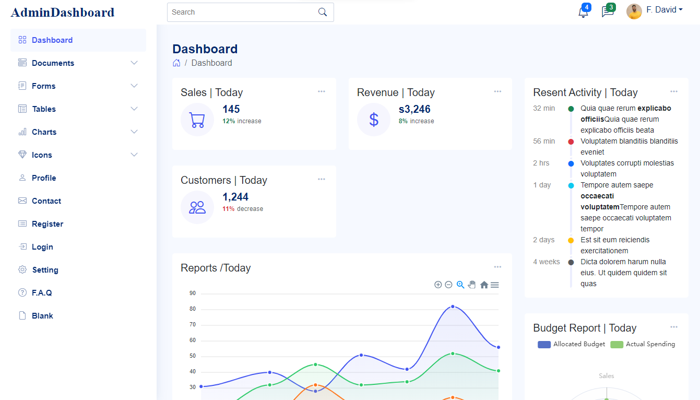

![GitHub live demo size(https://full-admin-dashboard.vercel.app/)]

 

<h2 align="center">Admin - DashBoard website</h2>

Admin dashBoard website which is fully responsive  
Responsive for all devices, built using React.js and bootstrap styling method. I run my api server with json which is the backend.This project I realy great Thanks for the view.

<a href="https://"><strong>➥ Live Demo</strong></a>

<!---------------------------- npx json-server --watch -p 3333 ./api/info.json ----------------------->

 

### Demo Desktop Screeshots

### Demo Moblie Screeshots

